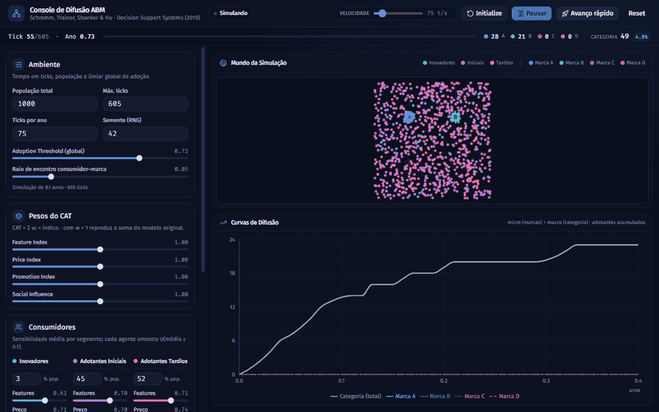
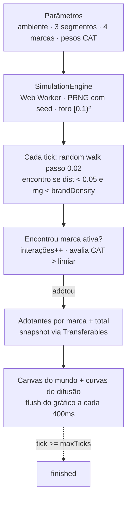

# abm-innovation-diffusion — Difusão de Inovações com Agentes (Schramm et al., 2010)

[](https://nextjs.org/)
[](https://www.typescriptlang.org/)
[](https://abm-innovation-diffusion.vercel.app)

> ### 🟢 Live Demo
>
> ## [Abrir: abm-innovation-diffusion.vercel.app](https://abm-innovation-diffusion.vercel.app)
>
> Clique **Setup**, depois **Run Simulation** — suba **Velocidade** para
> 600 t/s ou use **Avanço rápido** para ver as curvas-S de cada marca em segundos.



## O que é

Uma simulação interativa baseada em agentes da **difusão de inovações com
consumidores e marcas** (Schramm, Trainor, Shanker & Hu, *Decision Support
Systems*, 2010) — sem engine de ABM, sem biblioteca de simulação: TypeScript
puro (motor framework-agnostic rodando em Web Worker) + Canvas 2D + Recharts
no browser.

Cada consumidor caminha aleatoriamente pelo mundo e, ao encontrar uma marca
ativa, avalia um **Consumer Adoption Threshold (CAT)** — média ponderada de
4 índices — e adota se o valor superar o limiar global:

```text
FeatureIndex   = marca.features × agente.featureSensitivity
PriceIndex     = agente.priceSensitivity × (1 − marca.price)
PromotionIndex = agente.promoSensitivity × marca.promotion × min(interações / 10, 1)
SocialIndex    = agente.socialInfluenceSensitivity × (adotantesDaMarca / população)

CAT = wFeat·FeatureIndex + wPrice·PriceIndex + wPromo·PromotionIndex + wSocial·SocialIndex
adota se CAT > adoptionThreshold (0.73 por padrão)
```

## Arquitetura

O ciclo da simulação e o que ele faz com os agentes:



## Números

| Item | Valor |
|------|-------|
| População | 1.000 agentes (3% Inovadores · 45% Iniciais · 52% Tardios) |
| Marcas | 4 (`A`, `B`, `C`, `D` — entradas nos ticks 0, 45, 125, 150) |
| Mundo lógico | toro `[0,1)²` (física independente de tela/dPR) |
| Duração padrão | 605 ticks ≈ 8 anos (75 ticks/ano) |
| Limiar de adoção | `0.73` (global, configurável) |
| Raio de encontro | `0.05` do lado do mundo |
| Reprodutibilidade | PRNG com seed (`42` por padrão) |
| Sensibilidades | cada agente amostra `U(média ± 0.1)` por segmento |

## Controles

- **Setup / Run Simulation / Pausar–Retomar / Avanço rápido / Reset**
- **Velocidade** (5–600 ticks/s, ou avanço rápido em lotes até o fim)
- **Painel de parâmetros**: ambiente, 3 segmentos, 4 marcas, pesos do CAT
- **Mundo da Simulação** (Canvas: cor = segmento, depois = marca adotada)
- **Curvas de Difusão** (Recharts: micro por marca + macro da categoria)
- **StatusStrip**: tick, ano, adotantes vs. população total

## Nota de comportamento

Alterar qualquer parâmetro com a simulação em andamento **pausa e marca o
estado como stale** ("Parâmetros alterados — reinicialize"): é preciso clicar
**Setup** de novo — sem fast-forward fantasma. Antes da entrada da
primeira marca no mercado, os agentes **apenas se movem** (sem encontros nem
adoções). Comportamento esperado, não bug.

## Desenvolvimento

### Rodar local

```powershell
npm install
npm run dev                        # http://localhost:3000
```

### Verificação

```powershell
npm run lint                       # eslint .
npm run build                      # build Next/Turbopack de produção
```

### Estrutura

```text
app/page.tsx                              # página + orquestração dos controles
app/layout.tsx                            # layout, fontes, metadata
components/AppHeader.tsx                  # status, velocidade, Setup/Run/Pausar/Avanço/Reset
components/StatusStrip.tsx                # tick, ano, adotantes
components/ParamSlider.tsx                # slider reutilizável do painel
components/simulation/ConfigPanel.tsx     # ambiente, segmentos, marcas, pesos CAT
components/simulation/WorldCanvas.tsx     # Canvas 2D do mundo (toro)
components/simulation/DiffusionChart.tsx  # curvas-S por marca + total (Recharts)
hooks/useSimulation.ts                    # ponte React <-> Worker (buffer + flush 400ms)
lib/simulation/engine.ts                  # SimulationEngine: random walk, encontros, CAT
lib/simulation/defaults.ts                # parâmetros padrão, cores, constantes
lib/simulation/types.ts                   # contratos (params, snapshot, comandos/eventos)
lib/simulation/rng.ts                     # PRNG com seed (mulberry32)
worker/simulation.worker.ts               # loop com acumulador + snapshots transferíveis
```

## Créditos

Modelo de Schramm, Trainor, Shanker & Hu, "An agent-based diffusion model
with consumer and brand agents" — *Decision Support Systems*, 50(1), 234–242
(2010). Implementação própria em TypeScript/Next.js, sem dependência de
framework de ABM.
